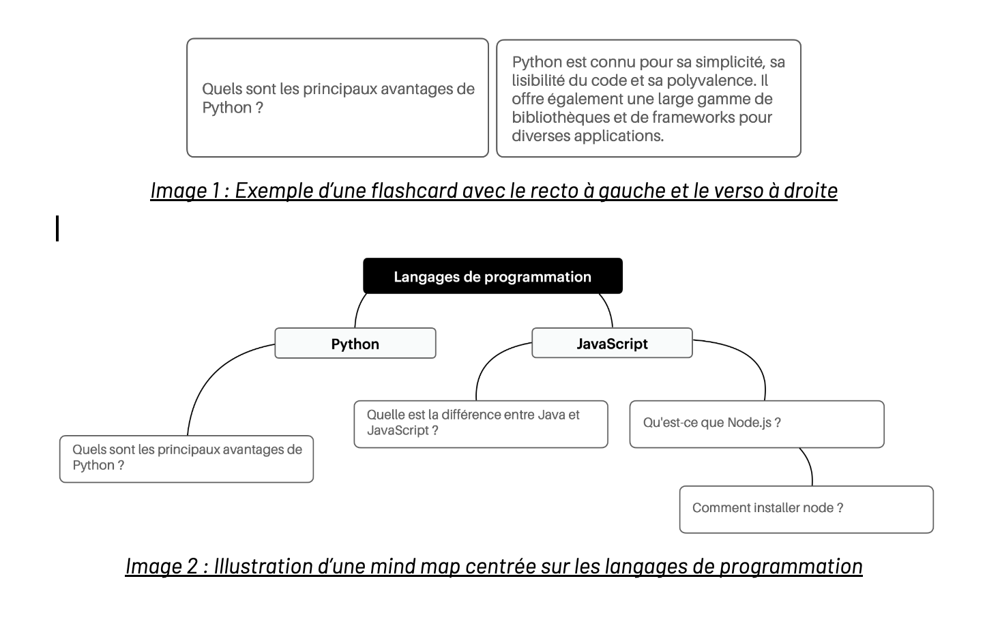
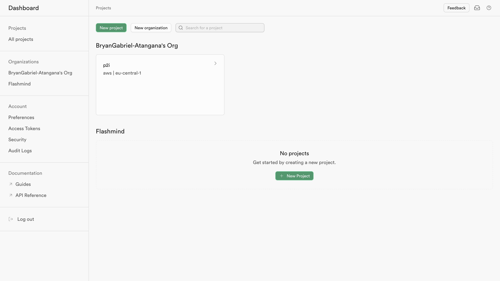
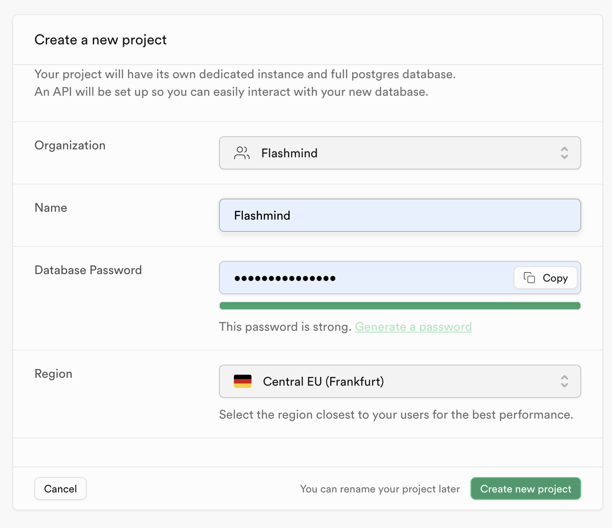
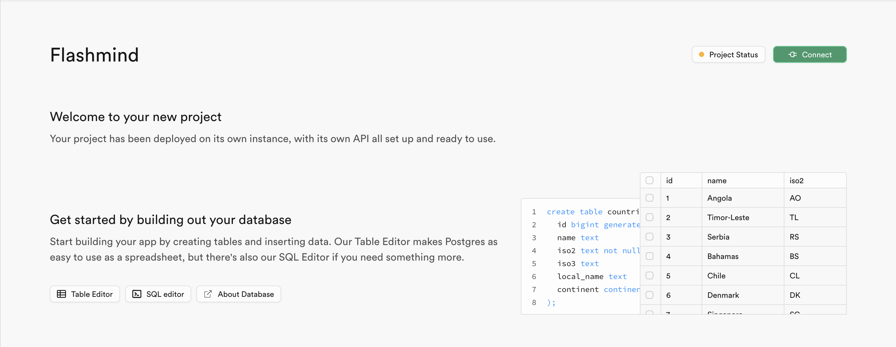
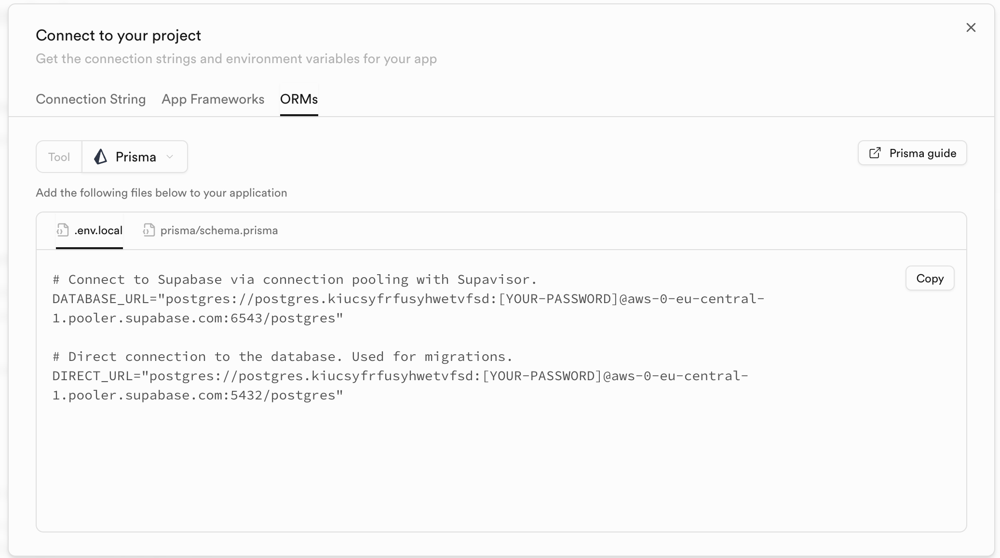

# FLASHMIND : Projet Informatique Individuel

## Introduction

L'idée principale de ce projet était de créer une version simplifiée d'une application de révision utilisant des flashcards, semblable à Quizlet. Cette idée a évolué vers une application permettant de créer et d'organiser des flashcards dans des cartes mentales.
Pour rappel, les flashcards ou cartes mémoires sont de petites cartes de révision/mémorisation qui permettent d'apprendre rapidement et efficacement un grand nombre d'informations courtes. Le principe est simple : sur chaque carte, on écrit une question ou un mot au recto, sa réponse au verso. Ensuite, on mémorise les cartes en faisant une sorte de quiz. Les cartes mentales (mind maps) quant à elles sont des graphiques représentant des idées, des tâches, des mots, des concepts qui sont liés entre eux autour d'un sujet central.
L’idée était donc de combiner ces deux méthodes de mémorisation pour catalyser la mémorisation lors des révisions.



## Procédure d'installation

1. Cloner le projet Flashmind

```
git clone https://github.com/BryanGabriel-Atangana/p2i_2024_flashmind.git
npm i
```

2. Créer un fichier .env à la racine

```
touch .env
```

3. Créer une base de données Supabase

- Se connecter sur https://supabase.com/
- Cliquer sur "new project"
  
- Remplir les champs et copier le mot de pase
  
- Coller dans votre fichier .env et cliquez sur "create new project".

```
MOT_DE_PASSE_SUPABASE = [Votre Mot de Passe]
```

-Lorque le projet est créé, cliquer sur "connect" puis allez sur l'onglet "ORM", sélectionnez "Prisma"



- Copier les informations qui s'affichent (DATABASE_URL et DIRECT_URL) et collez les dans le fichier .env
- Remplacez [YOUR-PASSWORD] par [Votre Mot de Passe]

Exécutez les commande ci-dessous

```
npx prisma
npx prisma init
npx prisma migrate dev --name init
```

4 . Créer un mot de passe NEXT AUTH

- Coller cette ligne dans votre fichier .env

```
NEXTAUTH_SECRET = [ENTRER UN MOT DE PASS]
```
